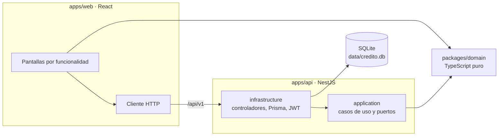

# Solicitud de crédito

[](https://github.com/hongs05/SolicitudDeCreditoMC/actions/workflows/ci.yml)

Simulación del ciclo de vida de una solicitud de crédito: captura, dictamen del comité de riesgo, desembolso y plan de pagos. Prueba técnica para MCSystems.

## Arranque rápido

Solo se necesita Docker con Compose v2.

```bash
docker compose up --build
```

| Servicio | Dirección |
|---|---|
| Aplicación web | http://localhost:8080 |
| API | http://localhost:3000/api/v1 |
| Documentación OpenAPI | http://localhost:3000/api/docs |

La base de datos SQLite queda en `data/credito.db`. Las migraciones y los datos de demostración se aplican solos al arrancar.

En Linux no hace falta dar permisos a `data/`: el contenedor se adueña de la carpeta al arrancar y luego ejecuta la API sin privilegios.

## Usuarios de demostración

Todos usan la contraseña `Demo2026!`.

| Usuario | Rol | Puede |
|---|---|---|
| `oficial` | OFICIAL | Registrar solicitudes |
| `analista` | ANALISTA | Aprobar o rechazar en el comité |
| `cajero` | CAJERO | Desembolsar créditos aprobados |
| `admin` | ADMIN | Todo lo anterior |

Cualquier usuario autenticado puede consultar solicitudes, créditos y planes de pago.

## Recorrido guiado

1. Entrar como `oficial` y registrar una solicitud con monto 10 000, 12 cuotas, tasa 12 % y periodicidad mensual. El panel lateral muestra la cuota de C$ 888.49 antes de enviar. **Cargar datos de ejemplo** llena el formulario de una vez.
2. Registrar otra solicitud con la misma cédula. El panel lo advierte mientras se escribe y, al registrar, un modal explica que ya hay una solicitud abierta y ofrece abrirla. La API responde `409 SOLICITUD_ABIERTA_EXISTENTE`.
3. Entrar como `analista`, abrir la solicitud en **Comité**, escribir observaciones y aprobarla. Se crea el crédito `CR-000001` con sus 12 cuotas.
4. Entrar como `cajero`, abrir el crédito en **Desembolsos**, elegir el banco y la cuenta, y procesar. El estado pasa a DESEMBOLSADA y se muestra el plan.
5. En **Plan de pagos**, buscar la cédula para ver el plan desde cualquier rol.
6. Para comprobar la regla principal por la API, intentar desembolsar otra vez el crédito del paso 4 (su id es `1` en una base nueva):

```bash
TOKEN=$(curl -s -X POST http://localhost:8080/api/v1/auth/login \
  -H 'Content-Type: application/json' \
  -d '{"username":"cajero","password":"Demo2026!"}' | sed -E 's/.*"accessToken":"([^"]+)".*/\1/')
curl -s -X POST http://localhost:8080/api/v1/desembolsos \
  -H "Authorization: Bearer $TOKEN" -H 'Content-Type: application/json' \
  -d '{"creditoId":1,"bancoId":1,"numeroCuenta":"1234567"}'
```

La respuesta es `409 CREDITO_YA_DESEMBOLSADO`. Una solicitud pendiente o rechazada no tiene crédito, así que tampoco hay nada que desembolsar (`404`). Con `-H 'Accept-Language: en'` el mensaje sale en inglés.

## Desarrollo sin Docker

Requiere Node 22.

```bash
npm install
npm run build -w @credito/domain
cp .env.example apps/api/.env
npm run db:migrate
npm run db:seed
npm run dev
```

La API resuelve `@credito/domain` a través de su salida compilada (`dist/`), por eso el paso de `build` va antes de levantar los servicios.

La web queda en http://localhost:5173 y hace proxy de `/api` a la API en el puerto 3000.

## Pruebas

| Comando | Qué cubre |
|---|---|
| `npm test` | Dominio, casos de uso de la API y frontend. Sin base de datos |
| `npm run test:int` | Repositorios Prisma, atomicidad y concurrencia contra SQLite real |
| `npm run test:e2e` | API completa por HTTP: flujo, matriz de roles, errores e idioma |
| `npm run test:all` | Todo lo anterior |
| `npm run test:cov -w @credito/domain` | Cobertura del dominio, con umbral del 95 % |
| `npm run lint` | Estilo y límites de la arquitectura |

## Arquitectura



Arquitectura hexagonal con la regla de dependencia de Clean Architecture. Las flechas solo apuntan hacia adentro, y `npm run lint` falla si alguien rompe esa regla.

- **`packages/domain`.** Entidades, máquina de estados, fórmula de la cuota nivelada, plan de amortización, cálculo de edad y catálogo de errores en español e inglés. No tiene dependencias. Lo usan la API y el frontend, así la cuota que ve el oficial es exactamente la que guarda el plan.
- **`application`.** Un caso de uso por acción de negocio. Recibe puertos, como repositorios y la unidad de trabajo, y no conoce Nest ni Prisma.
- **`infrastructure`.** Controladores, DTOs, guards, adaptadores Prisma y JWT. Es la única capa que conoce los frameworks.

Dónde está cada punto que evalúa el enunciado:

| Punto | Ubicación |
|---|---|
| Reglas de estado | `packages/domain/src/solicitud/estado-solicitud.ts` y la entidad `solicitud.ts` |
| Transacción de aprobación | `apps/api/src/solicitudes/application/aprobar-solicitud.use-case.ts` sobre `PrismaUnitOfWork` |
| Fórmula de la cuota | `packages/domain/src/credito/cuota-nivelada.ts` |
| Prueba de atomicidad | `apps/api/test/aprobacion.int.spec.ts` |

El diseño completo está en [docs/superpowers/specs/2026-09-24-solicitud-credito-design.md](docs/superpowers/specs/2026-09-24-solicitud-credito-design.md).

## Interpretaciones del enunciado

- **Plazo** es la cantidad de cuotas. Se muestra como "24 cuotas quincenales".
- **Periodicidad quincenal** usa `n = 24`, como indica el enunciado. Financieramente serían 26 quincenas al año.
- **Tasa 0 %:** la cuota es monto entre cuotas, para evitar la división por cero de la fórmula.
- **Observaciones** son obligatorias al aprobar y también al rechazar.
- **Edad:** se rechaza a quien tenga más de 80 años, como pide el enunciado; con 80 exactos se acepta. También se rechaza a los menores de 18, porque no pueden contratar un crédito.
- **Una solicitud abierta por cédula:** mientras una cédula tenga una solicitud pendiente o aprobada sin desembolsar, no se registra otra (409 `SOLICITUD_ABIERTA_EXISTENTE`). Rechazada o desembolsada, el cliente puede volver a solicitar.
- **Misma persona, misma fecha:** una cédula ya registrada debe traer la misma fecha de nacimiento (409 `CEDULA_FECHA_DISTINTA`); si no, es otra persona o un error de captura.
- **Antigüedad laboral:** no puede superar los años transcurridos desde los 14, la edad mínima para trabajar en Nicaragua (422 `ANTIGUEDAD_INCONSISTENTE`).
- **Formatos:** el nombre no admite dígitos y el teléfono solo dígitos, espacios, guiones, paréntesis y un `+` inicial. Los patrones están en el dominio, así el formulario y la API validan lo mismo.
- **Comité:** muestra exactamente los siete campos que lista el enunciado, sin datos laborales.
- **Moneda:** córdobas, con símbolo `C$`, porque los cuatro bancos operan en Nicaragua.
- **Zona horaria:** las fechas del negocio, como la fecha base del plan y la edad, se calculan en `America/Managua`.
- **Redondeo:** todo se calcula en centavos. La última cuota absorbe la diferencia para que el capital sume exactamente el monto.
- **Plazo máximo:** se rechazan plazos mayores a 30 años, sin importar la periodicidad (422 `PLAZO_MAXIMO_EXCEDIDO`).
- **Combinaciones inválidas de tasa y plazo:** si la cuota nivelada resultante no alcanza a cubrir el interés del primer periodo, el crédito nunca se saldaría, así que se rechaza (422 `PARAMETROS_CREDITO_INVALIDOS`).

## Estructura del repositorio

```
apps/api          API NestJS
apps/web          Frontend React
packages/domain   Reglas de negocio compartidas
data/             Archivo SQLite, montado en el contenedor
docs/             Enunciado, especificación, planes y bitácora de IA
```

## Limitaciones conocidas

- **Número de crédito.** Se calcula como el máximo más uno dentro de la transacción. Es seguro porque SQLite serializa las escrituras y la API serializa sus transacciones. Con varias instancias o con Postgres habría que usar una secuencia.
- **Una sola instancia de la API.** La cola de transacciones vive en memoria del proceso.
- **Plazos muy largos con tasas altas.** Al redondear la cuota al centavo, el crédito puede saldarse antes de la última cuota. El saldo nunca queda negativo y las cuotas restantes valen cero.
- **Refresco simultáneo en dos pestañas.** Si dos pestañas renuevan la sesión en el mismo instante, la detección de reuso revoca la familia de tokens y cierra la sesión en ambas. Es el comportamiento de seguridad diseñado; basta iniciar sesión de nuevo.
- **Secreto JWT de demostración** en `docker-compose.yml`. Se sobrescribe con la variable `JWT_SECRET`.
- **Sin HTTPS.** Detrás de un proxy con TLS, definir `COOKIE_SECURE=true`.

## Uso de IA

El proceso, los prompts y las decisiones tomadas frente a las propuestas de la IA están en [docs/bitacora-ia.md](docs/bitacora-ia.md).
