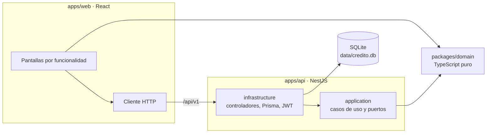

# Plan 4 de 4, parte B: README y Pull Request

> **For agentic workers:** REQUIRED SUB-SKILL: Use superpowers:subagent-driven-development (recommended) or superpowers:executing-plans to implement this plan task-by-task. Steps use checkbox (`- [ ]`) syntax for tracking.

Continuación de la [parte A](2026-09-25-04-infraestructura-entrega.md). El encabezado, las Global Constraints y el Review Focus de la parte A aplican aquí sin cambios.

---

### Task 3: README

**Files:**
- Modify: `README.md`

**Interfaces:**
- Consumes: todo lo construido. Los valores de puertos, usuarios, scripts y rutas deben coincidir con los planes anteriores.
- Produces: el README que exige el enunciado.

- [ ] **Step 1: Reemplazar el README**

`README.md`:

````markdown
# Solicitud de crédito

[](https://github.com/hongs05/SolicitudDeCreditoMC/actions/workflows/ci.yml)

Simulación del ciclo de vida de una solicitud de crédito: captura, dictamen del comité de riesgo, desembolso y plan de pagos. Prueba técnica para MCSystems.

## Arranque rápido

Solo se necesita Docker con Compose v2.

```bash
docker compose up --build
```

| Servicio | Dirección |
|---|---|
| Aplicación web | http://localhost:8080 |
| API | http://localhost:3000/api/v1 |
| Documentación OpenAPI | http://localhost:3000/api/docs |

La base de datos SQLite queda en `data/credito.db`. Las migraciones y los datos de demostración se aplican solos al arrancar.

**En Linux,** si la API no puede escribir en `data/`, el uid del usuario no es 1000. Dar permisos a la carpeta y volver a levantar:

```bash
chmod 777 data
```

## Usuarios de demostración

Todos usan la contraseña `Demo2026!`.

| Usuario | Rol | Puede |
|---|---|---|
| `oficial` | OFICIAL | Registrar solicitudes |
| `analista` | ANALISTA | Aprobar o rechazar en el comité |
| `cajero` | CAJERO | Desembolsar créditos aprobados |
| `admin` | ADMIN | Todo lo anterior |

Cualquier usuario autenticado puede consultar solicitudes, créditos y planes de pago.

## Recorrido guiado

1. Entrar como `oficial` y registrar una solicitud con monto 10 000, 12 cuotas, tasa 12 % y periodicidad mensual. El panel lateral muestra la cuota de C$ 888.49 antes de enviar.
2. Entrar como `analista`, abrir la solicitud en **Comité**, escribir observaciones y aprobarla. Se crea el crédito `CR-000001` con sus 12 cuotas.
3. Entrar como `cajero`, abrir el crédito en **Desembolsos**, elegir el banco y la cuenta, y procesar. El estado pasa a DESEMBOLSADA y se muestra el plan.
4. En **Plan de pagos**, buscar la cédula para ver el plan desde cualquier rol.
5. Para comprobar la regla principal, intentar desembolsar una solicitud que no está aprobada por la API:

```bash
TOKEN=$(curl -s -X POST http://localhost:8080/api/v1/auth/login \
  -H 'Content-Type: application/json' \
  -d '{"username":"cajero","password":"Demo2026!"}' | sed -E 's/.*"accessToken":"([^"]+)".*/\1/')
curl -s -X POST http://localhost:8080/api/v1/desembolsos \
  -H "Authorization: Bearer $TOKEN" -H 'Content-Type: application/json' \
  -d '{"creditoId":999,"bancoId":1,"numeroCuenta":"1234567"}'
```

La respuesta es un 404, porque una solicitud no aprobada no tiene crédito. Con `-H 'Accept-Language: en'` el mensaje sale en inglés.

## Desarrollo sin Docker

Requiere Node 22.

```bash
npm install
cp .env.example apps/api/.env
npm run db:migrate
npm run db:seed
npm run dev
```

La web queda en http://localhost:5173 y hace proxy de `/api` a la API en el puerto 3000.

## Pruebas

| Comando | Qué cubre |
|---|---|
| `npm test` | Dominio, casos de uso de la API y frontend. Sin base de datos |
| `npm run test:int` | Repositorios Prisma, atomicidad y concurrencia contra SQLite real |
| `npm run test:e2e` | API completa por HTTP: flujo, matriz de roles, errores e idioma |
| `npm run test:all` | Todo lo anterior |
| `npm run test:cov -w @credito/domain` | Cobertura del dominio, con umbral del 95 % |
| `npm run lint` | Estilo y límites de la arquitectura |

## Arquitectura



Arquitectura hexagonal con la regla de dependencia de Clean Architecture. Las flechas solo apuntan hacia adentro, y `npm run lint` falla si alguien rompe esa regla.

- **`packages/domain`.** Entidades, máquina de estados, fórmula de la cuota nivelada, plan de amortización, cálculo de edad y catálogo de errores en español e inglés. No tiene dependencias. Lo usan la API y el frontend, así la cuota que ve el oficial es exactamente la que guarda el plan.
- **`application`.** Un caso de uso por acción de negocio. Recibe puertos, como repositorios y la unidad de trabajo, y no conoce Nest ni Prisma.
- **`infrastructure`.** Controladores, DTOs, guards, adaptadores Prisma y JWT. Es la única capa que conoce los frameworks.

Dónde está cada punto que evalúa el enunciado:

| Punto | Ubicación |
|---|---|
| Reglas de estado | `packages/domain/src/solicitud/estado-solicitud.ts` y la entidad `solicitud.ts` |
| Transacción de aprobación | `apps/api/src/solicitudes/application/aprobar-solicitud.use-case.ts` sobre `PrismaUnitOfWork` |
| Fórmula de la cuota | `packages/domain/src/credito/cuota-nivelada.ts` |
| Prueba de atomicidad | `apps/api/test/aprobacion.int.spec.ts` |

El diseño completo está en [docs/superpowers/specs/2026-09-24-solicitud-credito-design.md](docs/superpowers/specs/2026-09-24-solicitud-credito-design.md).

## Interpretaciones del enunciado

- **Plazo** es la cantidad de cuotas. Se muestra como "24 cuotas quincenales".
- **Periodicidad quincenal** usa `n = 24`, como indica el enunciado. Financieramente serían 26 quincenas al año.
- **Tasa 0 %:** la cuota es monto entre cuotas, para evitar la división por cero de la fórmula.
- **Observaciones** son obligatorias al aprobar y también al rechazar.
- **Edad máxima:** se rechaza a quien tenga más de 80 años. Con 80 exactos se acepta.
- **Comité:** muestra exactamente los siete campos que lista el enunciado, sin datos laborales.
- **Moneda:** córdobas, con símbolo `C$`, porque los cuatro bancos operan en Nicaragua.
- **Zona horaria:** las fechas del negocio, como la fecha base del plan y la edad, se calculan en `America/Managua`.
- **Redondeo:** todo se calcula en centavos. La última cuota absorbe la diferencia para que el capital sume exactamente el monto.

## Estructura del repositorio

```
apps/api          API NestJS
apps/web          Frontend React
packages/domain   Reglas de negocio compartidas
data/             Archivo SQLite, montado en el contenedor
docs/             Enunciado, especificación, planes y bitácora de IA
```

## Limitaciones conocidas

- **Número de crédito.** Se calcula como el máximo más uno dentro de la transacción. Es seguro porque SQLite serializa las escrituras y la API serializa sus transacciones. Con varias instancias o con Postgres habría que usar una secuencia.
- **Una sola instancia de la API.** La cola de transacciones vive en memoria del proceso.
- **Plazos muy largos con tasas altas.** Al redondear la cuota al centavo, el crédito puede saldarse antes de la última cuota. El saldo nunca queda negativo y las cuotas restantes valen cero.
- **Secreto JWT de demostración** en `docker-compose.yml`. Se sobrescribe con la variable `JWT_SECRET`.
- **Sin HTTPS.** Detrás de un proxy con TLS, definir `COOKIE_SECURE=true`.

## Uso de IA

El proceso, los prompts y las decisiones tomadas frente a las propuestas de la IA están en [docs/bitacora-ia.md](docs/bitacora-ia.md).
````

- [ ] **Step 2: Verificar el README contra el código**

Comprobar cada dato del README contra la implementación real y corregir lo que no coincida:

- Los puertos y rutas de la tabla de arranque rápido.
- Los cuatro usuarios y la contraseña, contra `apps/api/src/shared/infrastructure/prisma/semilla.ts`.
- Los comandos de la tabla de pruebas, contra el `package.json` raíz.
- Las rutas de archivo de la tabla de arquitectura, con `ls`.
- El comando del paso 5 del recorrido, ejecutándolo con los contenedores arriba.

Run: `docker compose up -d --build --wait` y luego el bloque de `curl` del paso 5.
Expected: respuesta 404 con `"code":"NO_ENCONTRADO"`. Apagar con `docker compose down`.

- [ ] **Step 3: Commit**

```bash
git add README.md
git commit -m "docs: README con arranque, recorrido, arquitectura e interpretaciones"
```

---

### Task 4: Pull Request de entrega

**Files:**
- Modify: `docs/bitacora-ia.md`
- Create: `docs/pull-request.md` (borrador del cuerpo del PR, versionado para que el revisor lo lea también en el repositorio)

**Interfaces:**
- Consumes: la rama `feat/solicitud-credito` completa.
- Produces: Pull Request de `feat/solicitud-credito` hacia `main`.

- [ ] **Step 1: Verificación final**

Run: `npm ci && npm run lint && npm run test:cov -w @credito/domain && npm run test:all && npm run build`
Expected: todo en PASS y sin errores.

Run: `docker compose up -d --build --wait && curl -fsS http://localhost:8080/api/v1/health && docker compose down`
Expected: `{"status":"ok"}`.

Si algo falla, no continuar. Corregirlo en un commit propio antes de seguir.

- [ ] **Step 2: Cerrar la bitácora**

Agregar al final de la sección 3 de `docs/bitacora-ia.md`:

```markdown
### 3.6 Infraestructura y entrega

- **Fecha:** fecha de ejecución
- **Modelo:** modelo usado en la sesión de implementación
- **Objetivo:** contenerizar la solución, configurar CI y preparar la entrega.

**Resultados**

- Imágenes multi-stage para API y web, y `docker-compose.yml` que levanta todo con un comando.
- Workflow de CI con lint, pruebas, cobertura del dominio y prueba de humo sobre Docker.
- README con arranque, recorrido guiado, arquitectura, interpretaciones del enunciado y limitaciones.

**Validación del autor:** ejecución de `docker compose up --build` en limpio y recorrido completo en el navegador.
```

Reemplazar "fecha de ejecución" y "modelo usado en la sesión de implementación" por los valores reales. Agregar también a la tabla de la sección 4 cualquier propuesta de la IA que el autor haya modificado o rechazado durante la implementación.

- [ ] **Step 3: Escribir el cuerpo del Pull Request**

`docs/pull-request.md`:

```markdown
# Simulación del ciclo de vida de una solicitud de crédito

## Qué incluye

- Login con JWT, refresh token rotativo en cookie `httpOnly` y cuatro roles.
- Captura de solicitudes con cuota nivelada calculada en vivo y rechazo de mayores de 80 años.
- Comité de riesgo en solo lectura con los siete campos del enunciado, observaciones obligatorias y botones Aprobar Crédito y Rechazar Crédito.
- Aprobación atómica que crea el crédito `CR-000001` y todas sus cuotas de amortización.
- Desembolso a LAFISE, FICOHSA, BAC Credomatic o Banpro, solo para créditos aprobados.
- Extras: refresh token y consulta del plan de pagos por cédula.
- Interfaz y mensajes de error en español e inglés.

## Decisiones de arquitectura

- **Hexagonal con la regla de dependencia de Clean Architecture.** `application` no importa Nest ni Prisma, y el lint lo verifica.
- **Dominio compartido.** `packages/domain` es TypeScript puro que usan la API y el frontend. La fórmula de la cuota existe una sola vez.
- **Unidad de trabajo como puerto.** La aprobación declara que es atómica sin saber cómo. Prisma la implementa con una transacción interactiva, serializada en el proceso para que SQLite no falle con escrituras concurrentes.
- **Estado solo en la solicitud.** El crédito existe si y solo si la solicitud fue aprobada, y las restricciones de unicidad lo garantizan en la base.
- **Catálogos contra enums.** Bancos y tipos de empleo son tablas porque son datos. Periodicidad, estado y rol son enums porque llevan lógica.
- **Refresh opaco en cookie.** Se guarda solo su hash, rota en cada uso y un reuso revoca toda la familia de tokens.
- **Errores con código estable y mensaje traducido.** El dominio emite códigos. Un solo filtro los traduce según `Accept-Language`.
- **Fechas del negocio en `America/Managua`.** Evita que una aprobación nocturna quede con fecha del día siguiente.

## Cumplimiento del enunciado

| Requisito | Implementación | Prueba |
|---|---|---|
| No desembolsar créditos no aprobados | `Solicitud.desembolsar()` en el dominio | `solicitud.spec.ts`, `desembolsar.use-case.spec.ts`, `desembolsos.e2e.spec.ts` |
| Aprobación y cuotas atómicas | `AprobarSolicitud` sobre `PrismaUnitOfWork` | `aprobacion.int.spec.ts`, con fallo simulado a mitad de la inserción |
| Cuota nivelada en el frontend | `PanelCuota` con `calcularCuotaNivelada` del dominio | `NuevaSolicitudPage.spec.tsx`, caso A = 888.49 |
| Rechazo de mayores de 80 | `validarEdadMaxima` en dominio y formulario | `edad.spec.ts`, `solicitudes.e2e.spec.ts`, `NuevaSolicitudPage.spec.tsx` |
| Observaciones obligatorias | `Solicitud.aprobar()` y `DictamenPage` | `solicitud.spec.ts`, `DictamenPage.spec.tsx` |
| Número de crédito relacionado | `Credito.desde()` y columna `secuencia` | `aprobacion.int.spec.ts` |
| Plan con tantas cuotas como el plazo | `generarPlanAmortizacion` | `plan-amortizacion.spec.ts`, con pruebas de propiedades |
| JWT y refresh token | Módulo `auth` | `auth.e2e.spec.ts`, `cliente.spec.ts` |
| Búsqueda del plan por cédula | `GET /creditos?cedula=` y `ConsultaPage` | `creditos.e2e.spec.ts`, `ConsultaPage.spec.tsx` |
| Permisos por rol | Guards y `RequireRol` | `roles.e2e.spec.ts`, `auth.spec.tsx` |
| Docker de un solo comando | `docker-compose.yml` | Job `docker` de CI |

## Cómo probarlo

```bash
docker compose up --build
```

Abrir http://localhost:8080 con los usuarios de demostración del README. Todos usan la contraseña `Demo2026!`.

## Uso de IA

Se usó Claude Code para analizar el enunciado, diseñar la solución sección por sección con aprobación explícita, escribir los planes de implementación y ejecutarlos con TDD. Las decisiones propias frente a las propuestas de la IA están en la tabla de la sección 4 de [docs/bitacora-ia.md](docs/bitacora-ia.md).
```

Al final del cuerpo, agregar la línea de atribución de IA vigente en la sesión para descripciones de Pull Request.

- [ ] **Step 4: Commit**

```bash
git add docs/bitacora-ia.md docs/pull-request.md
git commit -m "docs: cierre de la bitácora y cuerpo del Pull Request"
```

- [ ] **Step 5: Pedir confirmación antes de publicar**

Detenerse y pedir al autor confirmación explícita para las dos acciones siguientes, que publican el trabajo fuera del equipo local:

1. `git push -u origin feat/solicitud-credito`
2. Abrir el Pull Request hacia `main`.

No continuar sin un "sí" del autor.

- [ ] **Step 6: Publicar**

Con la confirmación del autor:

```bash
git push -u origin feat/solicitud-credito
gh pr create --base main --head feat/solicitud-credito \
  --title "Simulación del ciclo de vida de una solicitud de crédito" \
  --body-file docs/pull-request.md
```

Expected: la URL del Pull Request. Revisar en GitHub que el job de CI termine en verde y compartir el enlace con el autor.
